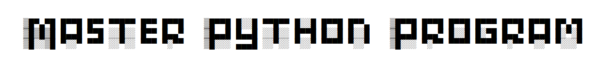

<div align="center">
  <a href="https://github.com/luca-hatu/Master-Python-Program">
    
  </a>
</div>

# About this project
For me, this is my biggest project. After doing multiple small Python apps, I decided it would be a good idea to put'em all in a bowl shake them, and TADAAM: you get this program. 
The name, Master Python Program is pretty much self-explanatory. It's a program you can run from which you can choose between other small programs that help you in your day-to-day life. 
You have a password manager, a password generator, a text encryption tool, a file encryption tool, a currency converter, a unit converter, and secure notes. 
All of these project's repos are linked in the last section.

# How to use it 

<div align="center">
  <a href="https://github.com/luca-hatu/Master-Python-Program">
    
  </a>
</div>
</br>
After downloading the installer and installing the app, open the main_menu.exe script
This is the main page you get after executing the app; you can choose between the apps displayed. Just click on the icons, and the app should just open.

# Requierments
> [!IMPORTANT]
> Important for the app to work correctly.
Please make sure you have the following libraries installed:
- cryptography
- Tkinter
- binascii
- pint
To install them:
``` 
$ pip install cryptography
``` 
``` 
$ pip install tk
``` 
``` 
$ pip install pycopy-binascii
```
```
$ pip install pint
```
> [!TIP]
> Normally, the app should work even without installing these, but if you get errors please check
# How to download
You can get the installer from 
[this repo](https://github.com/luca-hatu/Master-Python-Program-Executable)
, in the Installer folder, or from 
[this website](https://luca-hatu.github.io/Master-Python-Program-Executable/)

 # All repositories used
- [Password Manager](https://github.com/luca-hatu/Password-Manager)
- [Password Generator](https://github.com/luca-hatu/Password-Generator)
- [Encryption Tool](https://github.com/luca-hatu/Encryption-Tool)
- [Secure Notes](https://github.com/luca-hatu/Secure-Notes)
- [Unit Converter](https://github.com/luca-hatu/Unit-Converter)
- [Currency Converter](https://github.com/luca-hatu/Currency-Converter)
- [File Locker](https://github.com/luca-hatu/File-Locker)
